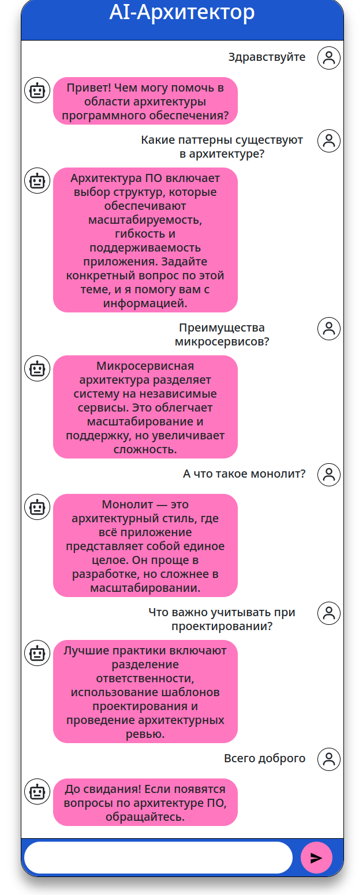

# Спринт 5 - Создание AI/ML чат-бота

Результат практики лежит в [rasa.log](./rasa.log)

Представленные в тренажере конфиги были кривые, пришлось править. Результат + модель лежит в [/rasa](./rasa)

Диалог с лога был примерно такой:

